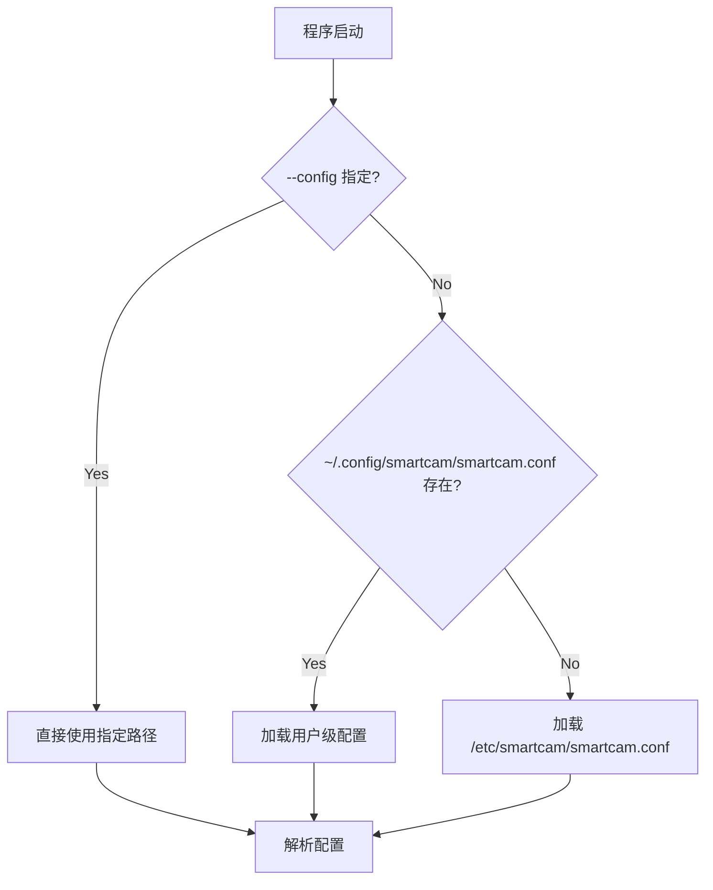

# 公共基础模块 — 实现记录

> **编号**：MOD-06
> **创建日期**：2026-05-24
> **状态**：✅ 已实现，语法检查通过
> **依赖**：C++17、pthread（mutex）、Linux syslog（可选）

---

## 一、模块概述

本模块由三个头文件组成，是 SmartCam 所有业务模块的**公共基础设施**，提供日志系统、环形缓冲区和共享类型定义。三个组件均为 header-only 设计，零额外编译单元，`#include` 即可使用。

### 本模块在项目中的位置

```
SmartCam 项目文件结构
    ┌──────────────────────────────────────┐
    │            include/common/            │
    │  ┌─────────┐ ┌─────────┐ ┌─────────┐ │
    │  │ logger.h │ │ringbuf.h│ │ types.h │ │
    │  └────┬─────┘ └────┬────┘ └────┬────┘ │
    └───────┼────────────┼───────────┼──────┘
            │            │           │
     ┌──────┼────────────┼───────────┼──────────────┐
     │      ▼            ▼           ▼              │
     │  ┌──────────────────────────────────────┐   │
     │  │         全部业务模块引用               │   │
     │  │  capture │ processor │ gui            │   │
     │  │  mjpeg_server │ control │ manager     │   │
     │  │  main          │                     │   │
     │  └──────────────────────────────────────┘   │
     └──────────────────────────────────────────────┘

依赖关系:
  所有 .cpp 文件 ──► logger.h    (日志宏 LOG_INF / LOG_DBG / LOG_WRN / LOG_ERR_)
  所有 .cpp 文件 ──► types.h     (PixelFormat / FrameBuffer / Resolution / CameraStatus)
  V4L2 缓冲区管理 ──► ringbuf.h   (帧缓冲队列)
```

### 子模块清单

| 子模块 | 文件 | 行数 | 功能 |
|--------|------|------|------|
| 日志系统 | `logger.h` | ~190 | 带颜色/时间戳/syslog 的线程安全日志 |
| 环形缓冲区 | `ringbuf.h` | ~140 | 线程安全固定容量环形队列模板 |
| 共享类型 | `types.h` | ~50 | PixelFormat / Resolution / FrameBuffer / CameraStatus |
| **配置管理** | **`config.h`** | **~180** | **INI 解析 + 写入 + 用户级配置优先级** |

---

## 二、文件清单

### 2.1 文件（3 个，全部 header-only）

```
SmartCam-Linux-on-imx6ull/
├── include/
│   └── common/
│       ├── logger.h         # Logger 单例 + LOG_* 便捷宏 (~190 行)
│       ├── ringbuf.h        # RingBuffer<T> 模板类 (~140 行)
│       └── types.h          # 共享类型定义 (~50 行)
└── docs/
    └── 06-common-module-implementation.md  # 本文档
```

### 2.2 被引用情况

| 头文件 | 被引用的模块 |
|--------|-------------|
| `logger.h` | capture.cpp, processor.cpp, gui.cpp, mjpeg_server.cpp, control.cpp, manager.cpp, **main.cpp** |
| `ringbuf.h` | capture.cpp（V4L2 mmap 缓冲区池管理） |
| `types.h` | 所有模块（FrameBuffer / PixelFormat 是模块间数据交换的基础类型） |

---

## 三、关键设计决策

### 3.1 为何 Header-only？

| 对比项 | header-only (本实现) | .h + .cpp 分离 |
|--------|---------------------|----------------|
| 编译复杂度 | 无额外 .cpp，include 即可 | 需维护两个文件 |
| 模板支持 | ✅ RingBuffer<T> 必须在头文件 | ❌ 模板不能分离编译 |
| 链接 | 零链接依赖 | 需链接 .o |
| 项目规模 | 适合 < 200 行的小型工具类 | 适合大型类 |

三个组件都是小型工具类（合计 ~380 行），header-only 是最简方案。

### 3.2 为何 Logger 用单例而不是全局变量？

```cpp
// 单例模式：线程安全的静态局部变量（C++11 保证）
static Logger* instance() {
    static Logger inst;  // ← 多线程安全，C++11 起保证
    return &inst;
}
```

- C++11 起，函数内 `static` 局部变量的初始化是线程安全的
- 单例避免全局变量初始化顺序问题（Static Initialization Order Fiasco）
- 延迟初始化：首次调用 `LOG_*` 宏时才构造，不影响启动速度

### 3.3 为何用 `std::mutex` 而不是无锁队列？

```
Logger 写入场景分析:
  - 采集线程：每帧 1 次 LOG_DBG (~每 33ms)
  - GUI 线程：用户交互时 1~2 次 LOG_INF
  - 控制线程：命令响应时 1 次 LOG_INF
  - MJPEG 线程：客户端连接时 1~2 次

结论：
  日志写入是低频、高延迟容忍的操作。mutex 的持有时间约几微秒
  （vsnprintf + fprintf + fflush），远小于帧间隔（33ms）。
  无锁队列反而增加复杂度且收益为零。
```

### 3.4 为何宏名用 `LOG_INF` 而不是 `LOG_INFO`？

syslog.h 中定义了 `LOG_INFO` 常量宏，直接使用会冲突。本模块在便捷宏定义前用 `#undef` 清除冲突，使用带下划线后缀的命名：

```cpp
#undef LOG_DEBUG   // 清除 syslog.h 的宏
#undef LOG_INFO
#undef LOG_WARNING
#undef LOG_ERR

#define LOG_DBG(fmt, ...)  ...  // DEBUG
#define LOG_INF(fmt, ...)  ...  // INFO
#define LOG_WRN(fmt, ...)  ...  // WARN
#define LOG_ERR_(fmt, ...) ...  // ERROR
```

`LOG_ERR_` 双下划线后缀是为了彻底避免与 `LOG_ERR` 宏冲突（部分 libc 实现会在编译后残留 `LOG_ERR` 的 `#define`）。

---

## 四、子模块详解

### 4.1 日志系统 (`logger.h`)

#### 核心接口

```cpp
enum class LogLevel { DEBUG = 0, INFO = 1, WARN = 2, ERROR = 3, NONE = 4 };

class Logger {
public:
    static Logger* instance();                     // 单例获取

    void setLevel(LogLevel level);                 // 过滤级别
    void setSyslogEnabled(bool enabled);           // syslog 开关
    void setTimestampEnabled(bool enabled);        // 时间戳开关

    void log(LogLevel level, const char* file, int line,
             const char* func, const char* fmt, ...);  // 核心方法
};
```

#### 使用方式

```cpp
#include "include/common/logger.h"

// 设置日志级别（可选，默认 DEBUG）
Logger::instance()->setLevel(LogLevel::INFO);    // 屏蔽 DEBUG 日志
Logger::instance()->setSyslogEnabled(true);      // 同时输出到 syslog

// 使用便捷宏（自动捕获 __FILE__, __LINE__, __func__）
LOG_DBG("Frame #%d: %d bytes, format=%d", index, len, fmt);
LOG_INF("Camera started on %s, %dx%d", device, w, h);
LOG_WRN("Video buffer timeout after %d ms", timeout);
LOG_ERR_("Failed to open device %s: %s", dev, strerror(errno));
```

#### 输出格式

```
# 控制台输出（带 ANSI 颜色）
14:30:25 [INFO] capture.cpp:142 (init) Camera started on /dev/video0, 640x480
14:30:26 [WARN] capture.cpp:189 (getFrame) Video buffer timeout after 1000 ms

# syslog 输出
May 24 14:30:25 hostname smartcam[1234]: capture.cpp:142 (init) Camera started on /dev/video0, 640x480
```

#### 颜色方案

| 级别 | ANSI 色码 | 视觉效果 |
|------|----------|---------|
| DEBUG | `\033[36m` (青) | 调试信息，低调 |
| INFO | `\033[32m` (绿) | 正常信息，醒目 |
| WARN | `\033[33m` (黄) | 警告，引起注意 |
| ERROR | `\033[31m` (红) | 错误，高亮 |

#### syslog 集成

```cpp
// 编译时启用（CMakeLists.txt）
target_compile_definitions(smartcam PRIVATE SMART_CAM_USE_SYSLOG)

// 或运行时启用
Logger::instance()->setSyslogEnabled(true);
// → openlog("smartcam", LOG_PID | LOG_NDELAY, LOG_USER)
// → syslog(prio, ...)
```

### 4.2 环形缓冲区 (`ringbuf.h`)

#### 核心接口

```cpp
template<typename T>
class RingBuffer {
public:
    explicit RingBuffer(int capacity);       // 固定容量

    bool push(const T& item);                // 入队（满则返回 false）
    bool pop(T& item);                       // 出队（空则返回 false）
    bool pushOverwrite(const T& item);       // 入队，满则覆盖最旧
    bool peek(T& item) const;                // 查看队头（不移除）
    void clear();                            // 清空

    int  size() const;                       // 当前元素数
    int  capacity() const;                   // 容量
    bool empty() const;                      // 是否为空
    bool full() const;                       // 是否已满
};
```

#### 内部结构

```
环形缓冲区（capacity = 4, size = 2）
     m_head (读指针)
        │
        ▼
   ┌───┬───┬───┬───┐
   │ A │ B │   │   │
   └───┴───┴───┴───┘
            ▲
            │
        m_tail (写指针)

push(C):  写入 B 之后，tail = (tail + 1) % 4 = 3
pop():    取出 A，head = (head + 1) % 4 = 1

pushOverwrite(D) 当 full() 时:
  写入 tail 位置（即 head 位置），tail=head=(head+1)%capacity
  → 覆盖最旧元素，head 追赶 tail
```

#### 典型用法：V4L2 帧缓冲池

```cpp
// 用于管理 V4L2 mmap 的 4 个缓冲区
struct BufferUnit {
    void*  start;
    size_t length;
};

RingBuffer<BufferUnit*> bufferPool(4);

// 初始化：全部入队（空闲缓冲区池）
for (int i = 0; i < 4; ++i) {
    bufferPool.push(&buffers[i]);
}

// 采集线程：
BufferUnit* buf;
bufferPool.pop(buf);    // 取出一个空闲缓冲区
ioctl(fd, VIDIOC_QBUF, buf);  // 入 V4L2 队列

// ... DQBUF 获取到数据后 ...

bufferPool.push(buf);    // 归还到空闲池
```

#### 线程安全设计

```cpp
bool push(const T& item) {
    std::lock_guard<std::mutex> lock(m_mtx);  // ← 所有方法都在 lock 内操作
    if (m_size >= m_capacity) return false;
    m_buffer[m_tail] = item;
    m_tail = (m_tail + 1) % m_capacity;
    m_size++;
    return true;
}
```

特点是**简单可靠**：所有 public 方法都在 `lock_guard` 作用域内完成，无中间状态暴露。

### 4.3 共享类型 (`types.h`)

#### PixelFormat 枚举

```cpp
enum class PixelFormat : uint32_t {
    FMT_YUYV   = 0x56595559,   // V4L2_PIX_FMT_YUYV
    FMT_MJPEG  = 0x47504A4D,   // V4L2_PIX_FMT_MJPEG
    FMT_RGB24  = 0x01010101,   // 内部格式: 24bit RGB
    FMT_RGB565 = 0x01010102,   // 内部格式: 16bit RGB565
};
```

四个字符码（FourCC）作为枚举值，可直接与 V4L2 的 `v4l2_pix_format.pixelformat` 字段对比。

#### Resolution

```cpp
struct Resolution {
    int width;
    int height;
    bool operator==(const Resolution&) const;
};

// 预定义的常用分辨率
inline constexpr Resolution RES_640x480  { 640,  480 };
inline constexpr Resolution RES_320x240  { 320,  240 };
inline constexpr Resolution RES_1280x720 { 1280, 720 };
```

`Q_DECLARE_METATYPE(Resolution)` 注册到 Qt 元对象系统，使其可作为 `QVariant` 传递（用于信号/槽跨线程通信）。

#### FrameBuffer

```cpp
struct FrameBuffer {
    uint8_t*  data     = nullptr;   // 帧数据指针
    int       length   = 0;         // 数据长度（字节）
    int       width    = 0;
    int       height   = 0;
    PixelFormat format = PixelFormat::FMT_RGB24;
    int       index    = 0;         // 帧序号（递增）
    std::chrono::steady_clock::time_point timestamp;
};
```

`FrameBuffer` 是模块间传递帧数据的核心结构。采集线程填充，GUI/Stream/Control 模块读取。`timestamp` 使用 `steady_clock` 而非 `system_clock`，避免系统时间跳变影响帧间间隔计算。

#### CameraStatus

```cpp
struct CameraStatus {
    bool     streaming    = false;
    bool     recording    = false;
    int      fps          = 0;
    Resolution resolution = RES_640x480;
    PixelFormat format    = PixelFormat::FMT_YUYV;
    int      client_count = 0;
};
```

状态快照结构体，用于 ControlServer 的 `CMD_GET_STATUS` 响应和 GUI 状态栏更新。

---

## 五、与其他模块的关系

```
                    ┌──────────────────────────┐
                    │       include/common/     │
                    │  ┌──────┬────────┬──────┐ │
                    │  │logger│ ringbuf│types │ │
                    │  └──┬───┴───┬────┴──┬───┘ │
                    └─────┼───────┼───────┼─────┘
                          │       │       │
     ┌────────────────────┼───────┼───────┼──────────────────────────────┐
     │                    │       │       │                              │
     ▼                    ▼       ▼       ▼                              ▼
┌──────────┐    ┌──────────┐  ┌──────────┐  ┌──────────┐    ┌──────────────┐
│ capture  │    │ processor│  │   gui    │  │ mjpeg_   │    │   control    │
│ (采集)    │    │ (处理)    │  │ (显示)   │  │ server   │    │   (控制)     │
├──────────┤    ├──────────┤  ├──────────┤  ├──────────┤    ├──────────────┤
│ ringbuf  │    │ logger ✓ │  │ logger ✓ │  │ logger ✓ │    │ logger ✓     │
│ 管理帧池  │    │ types  ✓ │  │ types  ✓ │  │ types  ✓ │    │ types  ✓     │
│ logger ✓ │    └──────────┘  └──────────┘  └──────────┘    │ StatusPayload│
│ types  ✓ │                                                 │ (派生自types)│
└──────────┘                                                 └──────────────┘

各模块引用情况:
  logger.h → 所有模块（7 个 .cpp 文件）
  ringbuf.h → capture.cpp（V4L2 帧池）
  types.h  → 所有模块（FrameBuffer 是模块间数据交换的基础类型）
```

---

## 六、编译配置

```cmake
# CMakeLists.txt 中的相关部分

# types.h 需要 Qt 元类型注册
set(CMAKE_AUTOMOC ON)  # ← 自动处理 Q_DECLARE_METATYPE

# logger 的 syslog 功能（编译时可选）
# target_compile_definitions(smartcam PRIVATE SMART_CAM_USE_SYSLOG)

# include 路径（已全局配置）
target_include_directories(smartcam PRIVATE
    ${CMAKE_SOURCE_DIR}
    ${CMAKE_SOURCE_DIR}/include
)
# → #include "include/common/logger.h" 即可
```

三个文件均为 header-only，无需额外链接库。`types.h` 依赖 Qt 的 `QMetaType` 宏（已在 `find_package(Qt5)` 中满足）。

---

## 七、设计模式与面试要点

### 设计模式

| 模式 | 应用 | 位置 |
|------|------|------|
| **单例模式** | Logger 全局唯一实例 | `Logger::instance()` |
| **模板方法** | RingBuffer 泛型容器 | `RingBuffer<T>` |
| **RAII** | `lock_guard` 自动释放锁 | 所有 RingBuffer 方法 |
| **策略模式** | Logger 输出目标可切换（控制台 / syslog） | `setSyslogEnabled()` |

### 面试可追问的要点

**Q1: 为什么 Logger 的 `log()` 方法不是虚函数？**

> Logger 是单例，不存在继承体系。输出目标切换通过 `m_useSyslog` 标志位实现，而非子类化。这与策略模式的思想一致：用组合（标志位切换行为）代替继承。

**Q2: RingBuffer 的 `pushOverwrite()` 在 head==tail 时如何区分满和空？**

> 用 `m_size` 成员显式记录当前元素数。`m_size >= m_capacity` 为满，`m_size <= 0` 为空。这是最简单的「计数法」实现，额外存储一个 int 即可避免「留一位标记」的容量浪费。

**Q3: FrameBuffer 中的 `data` 指针由谁管理生命周期？**

> 采集线程负责在 `getFrame()` 后 memcpy 到用户空间 buffer，并在使用完毕后调用 `putFrame()` 归还 V4L2 mmap 缓冲区。`FrameBuffer` 本身不含所有权语义——它只是模块间的数据传递「快照」。

**Q4: 日志系统的性能开销有多少？**

> 每条日志约 5-10 微秒（vsnprintf + fprintf + fflush）。在 30fps 的采集线程中，每帧一条 LOG_DBG 占 CPU 时间不到 0.1%。关键路径（采集→显示）不使用日志。

---

---

## 八、配置管理器 (`config.h`) — v0.5 增强

### 8.1 原始设计（只读 INI 解析器）

```cpp
class ConfigManager {
public:
    bool load(const std::string& path);        // 从 INI 文件加载

    std::string getString(section, key, def);  // 读取字符串
    int         getInt(section, key, def);     // 读取整数
    bool        getBool(section, key, def);    // 读取布尔
    bool        hasSection(section);            // 检查段存在
    bool        hasKey(section, key);           // 检查键存在
};
```

原始设计仅支持**读取**，不支持回写。这导致 GUI 中的存储路径切换等持久化操作无法实现。

### 8.2 v0.5 新增：写入支持

为了支持用户通过 Settings 面板修改存储路径并持久化到配置文件，ConfigManager 新增三个写接口和一个目录创建辅助函数：

```cpp
class ConfigManager {
    // ...原有只读接口...

    // v0.5 新增
    void setString(const std::string& section,
                   const std::string& key,
                   const std::string& value);      // 内存中修改/新增键值对

    bool save() const;                              // 写回加载时的文件
    bool saveAs(const std::string& path) const;     // 写入指定文件（自动创建父目录）

private:
    static void mkdirParents(const std::string& path);  // 递归 mkdir -p
};
```

#### `setString()` — 内存修改

```cpp
void ConfigManager::setString(const std::string& section,
                               const std::string& key,
                               const std::string& value) {
    m_data[section][key] = value;  // map 的 operator[] 自动创建不存在的 section/key
}
```

直接操作 `std::map<std::string, std::map<std::string, std::string>>` 内层容器。

#### `save()` / `saveAs()` — 持久化

```cpp
bool ConfigManager::save() const {
    std::ofstream file(m_path);
    for (const auto& sec : m_data) {
        file << "[" << sec.first << "]\n";
        for (const auto& kv : sec.second) {
            file << kv.first << " = " << kv.second << "\n";
        }
        file << "\n";   // section 之间空行分隔
    }
    return file.good();
}
```

输出格式与 `load()` 的解析格式完全兼容，支持回读。

#### `mkdirParents()` — 自动 mkdir -p

```cpp
static void mkdirParents(const std::string& path) {
    size_t slash = path.rfind('/');
    if (slash != std::string::npos && slash > 0) {
        mkdirParents(path.substr(0, slash));  // 递归创建父目录
    }
    mkdir(path.c_str(), 0755);  // 忽略 EEXIST
}
```

`saveAs()` 在打开文件前调用此函数，确保 `~/.config/smartcam/` 这类首次写入的路径存在。

### 8.3 配置加载优先级（main.cpp 中的实现）

```cpp
// main.cpp: 配置加载逻辑
ConfigManager cfg;
QString configPath;

if (parser.isSet(configOpt)) {
    configPath = parser.value(configOpt);       // 1. 命令行 --config 显式优先
} else {
    const char* home = getenv("HOME");
    if (home) {
        std::string userCfg = string(home) + "/.config/smartcam/smartcam.conf";
        if (cfg.load(userCfg)) {                // 2. 用户级配置优先
            configPath = QString::fromStdString(userCfg);
        }
    }
    if (configPath.isEmpty()) {
        configPath = "/etc/smartcam/smartcam.conf";  // 3. 系统级兜底
    }
}
bool cfgLoaded = cfg.load(configPath.toStdString());
```



### 8.4 调用端：存储路径持久化流程

```
用户在 Settings 面板选择 "Persistent (eMMC)"
  │
  ▼
gui.onStorageComboChanged()  → 回调触发
  │
  ▼
main.cpp callback:
  │
  ├─► g_storage→setPhotoDir("/home/debian/smartcam/photos")  # 即时生效
  ├─► g_storage→setVideoDir("/home/debian/smartcam/videos")
  │
  └─► cfg.setString("storage", "photo_dir", "/home/debian/smartcam/photos")
      cfg.setString("storage", "video_dir", "/home/debian/smartcam/videos")
           │
           ├─► cfg.save()                     # Step 1: 尝试写原路径
           │       ↓ 失败（非 root 无权写 /etc/）
           └─► cfg.saveAs(userCfg)            # Step 2: 写 ~/.config/smartcam/...
                   ↓ mkdirParents() 自动创建 ~/.config/smartcam/
                   ✅ 持久化成功
```

### 8.5 设计要点

**Q: 为什么不直接用 JSON/TOML 而是手写 INI？**

> INI 格式简单直白，手写解析器无需引入任何第三方库。配置内容仅几十行，JSON 库（nlohmann/json ≈ 30KB 头文件）的复杂度收益比低。控制端口等其他功能用自定义二进制协议（`control.h`），无需 JSON。

**Q: `mkdirParents` 有问题吗——它忽略了 `mkdir` 的返回值？**

> 是故意的。递归创建时，中间目录可能已存在（`EEXIST`），这不算错误。最终 `saveAs()` 中的 `ofstream::is_open()` 才是真正的失败检测。如果任何一级目录创建失败（如权限不足），`ofstream` 打开文件时会失败，`saveAs()` 返回 `false`。

**Q: 用户级配置和系统级配置会不会冲突？**

> 配置加载是**互斥**的——一旦用户级配置存在，就不加载系统级配置。这意味着用户级配置必须包含所有需要的字段（通过从系统级"继承"并修改而来）。当前实现中，用户级配置由 `saveAs()` 从内存中全量写入（包含所有 section），因此不会丢失字段。

## 九、后续 TODO

- [ ] `ringbuf.h` 增加 `tryPop()` 方法（非阻塞 + 超时，使用条件变量）
- [ ] `logger.h` 增加日志文件轮转功能（按大小/日期切分）
- [ ] `logger.h` 增加编译期日志级别过滤（`#if SMART_CAM_LOG_LEVEL >= 2` 避免 DEBUG 日志的运行时判断）
- [ ] `types.h` 增加 `StreamConfig` / `RecordConfig` 等配置结构体
- [ ] `ringbuf.h` 增加 `std::atomic` 无锁版本（用于高频帧队列）
- [ ] 日志输出到 SD 卡文件（`/var/log/smartcam.log`）

---

## 十、变更记录

| 日期 | 变更内容 |
|------|----------|
| 2026-05-24 | 文档创建：Logger 单例、RingBuffer 模板、共享类型定义的设计说明与使用指南 |
| 2026-05-27 | v0.5：ConfigManager 增强 — `setString()`/`save()`/`saveAs()`/`mkdirParents()` 写支持；配置加载优先级；存储路径持久化集成 |
