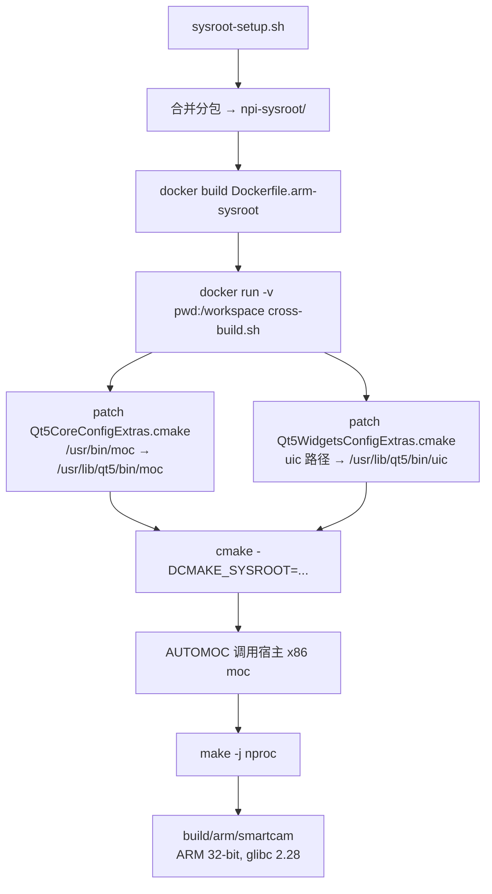

# SmartCam Linux — Debug 总结文档

> 持续更新，记录 imx6ull-pro 开发板调试过程中遇到的所有问题。

---

## 1. GUI 不支持的像素格式 (MJPG) ✅ 已解决

| 属性 | 值 |
|------|-----|
| **模块** | `src/display/gui.cpp` |
| **现象** | GUI 不显示 MJPEG 格式的画面 |
| **严重程度** | ❌ 严重 — 画面不显示 |

### 解决

`frameToQImage()` 添加 `FMT_MJPEG` 解码分支

---

## 2. Corrupt JPEG data 警告刷屏 ✅ 已解决

| 属性 | 值 |
|------|-----|
| **模块** | `src/display/gui.cpp` |
| **现象** | 控制台不断输出 `Corrupt JPEG data` 警告 |
| **严重程度** | ⚠️ 次要 |

### 解决

自定义 libjpeg 错误处理器静默所有输出

---

## 3. ARM 交叉编译 jpeglib.h 包含位置错误 ✅ 已解决

| 属性 | 值 |
|------|-----|
| **模块** | `src/camera/processor.cpp` |
| **现象** | ARM 交叉编译时 `jpeglib.h` 找不到 |
| **严重程度** | ❌ 严重 — 编译不通过 |

### 解决

`#include <jpeglib.h>` 移到文件顶部

---

## 4. 线程自 join 死锁 (EDEADLK) ✅ 已解决

| 属性 | 值 |
|------|-----|
| **模块** | `src/network/mjpeg_server.cpp` |
| **现象** | 进程在退出时 abort，错误码 `EDEADLK` |
| **严重程度** | ❌ 严重 — 进程 abort |

### 解决

`detach` 模式替代 `thread->join()`

**涉及文件：** `src/network/mjpeg_server.cpp`

---

## 5. GUI 显示闪烁 / 坏帧 ✅ 已解决

| 属性 | 值 |
|------|-----|
| **模块** | `src/display/gui.cpp` |
| **现象** | GUI 画面闪烁、出现坏帧 |
| **严重程度** | ❌ 严重 |

### 解决

深拷贝帧数据 + libjpeg 自定义静默错误处理器

**涉及文件：** `src/display/gui.cpp`、`include/display/gui.h`

---

## 6. YUYV 格式推流打通 ✅ 已解决

| 属性 | 值 |
|------|-----|
| **模块** | `src/main.cpp` — 采集线程推流逻辑 |
| **现象** | `--fmt yuyv` 模式下 MJPEG/RTSP 流均不可用 |
| **严重程度** | ⚠️ 中等 |

### 解决

1. MJPEG/RTSP 服务器始终启动
2. 采集线程 `encodeYUYVtoJPEG()` 编码一次，复用给两个流

**涉及文件：** `src/main.cpp`

---

## 6b. systemd 服务文件完善 ✅ 已解决

| 属性 | 值 |
|------|-----|
| **模块** | `configs/smartcam.service` |
| **现象** | `Type=forking` 不匹配，`ExecStop` 引用不存在子命令 |
| **严重程度** | — |

### 解决

`Type=simple` + 删除 `ExecStop` + 新增安全加固

**涉及文件：** `configs/smartcam.service`

---

## 7. 配置文件解析实现 ✅ 已解决

| 属性 | 值 |
|------|-----|
| **模块** | `include/common/config.h`、`src/main.cpp` |
| **现象** | `configs/smartcam.conf` 已写好但从未被解析 |
| **严重程度** | ⚠️ 中等 — 需要手动指定所有参数 |

### 实现

1. 新建 `ConfigManager` — header-only INI 解析器
2. `main.cpp` 集成：`--config` 命令行选项 + 配置合并
3. 优先级：命令行 > 配置文件 > 硬编码默认值

**涉及文件：** `include/common/config.h`（新增）、`src/main.cpp`、`configs/smartcam.conf`

---

## 8. 相册模块实现 ✅ 已解决

| 属性 | 值 |
|------|-----|
| **模块** | `include/display/gallery.h`、`src/display/gallery.cpp`（新增） |
| **现象** | 没有浏览和管理已拍摄照片的功能 |
| **严重程度** | 🟡 次要 — 用户体验提升 |

### 实现

1. **StorageManager 扩展** — 新增 `listPhotos()`、`getPhotoCount()`、`deletePhoto()`、`readJpegSize()`
2. **PhotoGallery 类** — 缩略图网格（3列）+ 全屏查看 + 翻页/删除
3. **CameraGUI 集成** — QStackedWidget 切换实时预览/相册，Gallery 按钮
4. **JPEG 快速尺寸读取** — 扫描 SOF0 标记，只读 4KB 不解码像素

**涉及文件：** manager.h/cpp, gallery.h/cpp, gui.h/cpp, main.cpp, CMakeLists.txt

---

## 9. 触摸屏无响应（开发板）✅ 已解决

| 属性 | 值 |
|------|-----|
| **模块** | Qt linuxfb 内置 evdev 输入 / 设备权限 |
| **现象** | 开发板上 GUI 正常显示，但触摸按钮无任何反馈 |
| **严重程度** | ❌ 严重 — GUI 完全不可操作 |

### 原因

**设备权限不足**，与 Qt 插件无关。`/dev/input/event2` 默认属主 `root:input`，权限 `660`，当前用户 `debian` 不在 `input` 组中，无法读取触摸事件。

> linuxfb 后端**内置了 evdev 输入支持**，会自动检测 `/dev/input/` 下的触摸设备，**不需要**任何环境变量或额外插件。

### 解决（永久）

```bash
sudo usermod -a -G input debian
# 重新登录或重启生效
```

### 解决（临时，重启失效）

```bash
sudo chmod 666 /dev/input/event2
```

### 正确的启动命令

```bash
# 不需要任何环境变量！
./smartcam --device /dev/video0 --fmt mjpeg -platform linuxfb
```

### 排查方法

```bash
# 1. 确认触摸设备节点
ls -la /dev/input/event*
# 触摸屏幕看是否有输出 → 有输出说明内核驱动正常，只是用户无权限
cat /dev/input/event2 | hexdump

# 2. 确认当前用户在 input 组
groups | grep input

# 3. 确认 linuxfb 已识别触摸设备（看日志有无 "evdev" 字样）
export QT_LOGGING_RULES="qt.qpa.input=true"
./smartcam -platform linuxfb 2>&1 | head -20
```

### 常见误区 ❌

以下做法**不仅无效，还会导致 segfault**：

- `export QT_QPA_GENERIC_PLUGINS=evdevtouch` — linuxfb 内置了 evdev 支持，手动加载会**冲突**导致崩溃
- `export QT_PLUGIN_PATH=...` — 覆盖默认插件搜索路径，导致其他必需插件丢失
- `export QT_QPA_EVDEV_TOUCHSCREEN_PARAMETERS=...` — 无头附加无插件的参数，无作用

**涉及文件：** `docs/debug-summary.md`

---

## 10. Gallery 不显示视频文件 ✅ 已解决

| 属性 | 值 |
|------|-----|
| **模块** | `src/storage/manager.cpp` / `src/display/gallery.cpp` |
| **现象** | 拍照后在 Gallery 正常看到照片，但录像后 Gallery 看不到任何视频文件 |
| **严重程度** | ⚠️ 中等 — 用户无法确认录像是否成功保存 |

### 原因

`StorageManager` 只实现了 `listPhotos()`（扫描 `m_photoDir` 下的 `.jpg`），完全没有视频列表功能。视频虽然被录制到 `m_videoDir` 下的 `.avi` 文件，但 Gallery 的 `refresh()` 只调 `listPhotos()`，从不查询视频目录。

### 解决

1. **`PhotoInfo` 新增 `isVideo` 字段** — 标记媒体类型
2. **`StorageManager` 新增 3 个方法**：
   - `listVideos()` — 扫描 `m_videoDir` 下的 `.avi` 文件，逻辑与 `listPhotos` 对称
   - `getVideoCount()` — 快速统计视频数量
   - `deleteVideo()` — 删除视频文件并清理空目录
3. **`PhotoGallery::refresh()` 合并照片+视频列表** — 按时间戳混排，重建日期分组
4. **缩略图网格视频区分**：视频项显示 ▶ 绿箭头图标 + 底部 `[VID]` 标签
5. **全屏视图视频占位**：显示 ▶ + 文件名 + 大小（AVI 暂不渲染缩略图）
6. **删除逻辑适配**：`onDeletePhoto()` 根据 `isVideo` 调用不同删除方法

### 涉及文件

`include/storage/manager.h`、`src/storage/manager.cpp`、`src/display/gallery.cpp`

---

## 11. 视频播放器编译错误：AviIndexEntry/AviMainHeader 非类成员 ✅ 已解决

| 属性 | 值 |
|------|-----|
| **模块** | `include/display/video_player.h` / `src/display/video_player.cpp` |
| **现象** | `'AviIndexEntry' is not a member of 'StorageManager'` — 所有引用处报错，连 `gui.cpp` / `main.cpp` 也因间接 include 被连带 |
| **严重程度** | ❌ 严重 — 编译不通过 |

### 原因

`video_player.h` 和 `video_player.cpp` 中使用了 `StorageManager::AviIndexEntry` 和 `StorageManager::AviMainHeader`，但这些结构体定义在 `StorageManager` **类外部**（`manager.h` 中类声明之前，全局命名空间）：

```cpp
// include/storage/manager.h

#pragma pack(push, 1)      // ← 全局作用域

struct RiffChunk { ... };
struct AviMainHeader { ... };   // ← 全局 struct，不属于 StorageManager
struct AviStreamHeader { ... };
struct BitmapInfoHeader { ... };
struct AviIndexEntry { ... };   // ← 全局 struct，不属于 StorageManager
struct AviFrameChunk { ... };

#pragma pack(pop)

class StorageManager {          // ← 类定义从这里才开始
    ...
    // PhotoInfo / PhotoDayGroup 等定义在类内部 → 需要 StorageManager:: 前缀
};
```

**区分规则**：
- `PhotoInfo`、`PhotoDayGroup` → 定义在 `StorageManager` 类内 → 必须用 `StorageManager::PhotoInfo`
- `AviMainHeader`、`AviIndexEntry`、`RiffChunk` 等 → 定义在类外（全局）→ **不能用** `StorageManager::` 前缀

### 解决

去掉所有 AVI 结构体的 `StorageManager::` 前缀（共 4 处）：

| 文件 | 错误写法 | 正确写法 |
|------|----------|----------|
| `video_player.h:101` | `std::vector<StorageManager::AviIndexEntry>` | `std::vector<AviIndexEntry>` |
| `video_player.cpp:334` | `StorageManager::AviMainHeader avih` | `AviMainHeader avih` |
| `video_player.cpp:388` | `sizeof(StorageManager::AviIndexEntry)` | `sizeof(AviIndexEntry)` |
| `video_player.cpp:391` | `sizeof(StorageManager::AviIndexEntry)` | `sizeof(AviIndexEntry)` |

### 涉及文件

`include/display/video_player.h`（1 处）、`src/display/video_player.cpp`（3 处）

---

## 12. ARM 交叉编译产物 GLIBC 版本不兼容 ✅ 已解决

| 属性 | 值 |
|------|-----|
| **模块** | 交叉编译工具链 / Docker 镜像 |
| **现象** | 开发板运行交叉编译产物报：`GLIBCXX_3.4.29 not found`、`GLIBC_2.33 not found`、`GLIBC_2.34 not found` |
| **严重程度** | ❌ 严重 — 程序无法启动 |

### 原因

Docker 基于 Ubuntu 22.04（glibc 2.35, GCC 11），其 armhf 仓库中的 Qt5/libjpeg 都链接到 glibc 2.35。但 i.MX6ULL 开发板一般跑 Debian Buster/Bullseye（glibc 2.28~2.31），运行时报这些符号不存在。

| 依赖库 | Docker (Ubuntu 22.04 armhf) | 开发板 (Debian) |
|--------|---------------------------|-----------------|
| libstdc++ | GCC 11 → `GLIBCXX_3.4.29` | GCC 8/10 → `GLIBCXX_3.4.25` |
| glibc | 2.35 | 2.28~2.31 |

### 解决方案：sysroot 交叉编译

**核心思路**：不使用 Docker 中 Ubuntu armhf 包作为依赖，而是直接使用**开发板自身的根文件系统**作为 ARM 库来源。开发板上已有的 Qt5、libjpeg 和系统库，版本和板子完全匹配。

**完整链路**（适用于云端开发环境无法直连开发板）：

```
开发板 ──[tar + git push]──▶ GitHub ──[git pull]──▶ 云端编译环境
```

**解决方案涉及的代码改动：**

1. **`CMakeLists.txt`** — ARM 交叉编译时 `target_link_options(smartcam PRIVATE -static-libstdc++ -static-libgcc)` 消除 libstdc++ 依赖
2. **`configs/toolchain.arm.cmake`** — 支持 `CMAKE_SYSROOT`，允许指定开发板根文件系统路径
3. **`Dockerfile.arm-sysroot`**（新增）— 精简 Docker 镜像，只装交叉编译器 + cmake，不安装 armhf 包
4. **`.gitattributes` / `.gitignore`** — 管理 sysroot 分包文件
5. **`scripts/sysroot-from-board.sh`**（新增）— 在开发板上打包、提交并推送 sysroot 到 GitHub
6. **`scripts/sysroot-setup.sh`**（新增）— 在编译环境拉取、合并 sysroot 并执行交叉编译

**开发板打包注意事项（i.MX6ULL 内存不足问题）：**

板子仅 512MB 物理内存（CMA 占 327MB，可用 ~185MB），`git push` 时默认 delta 压缩会触发 OOM killer。

解决方案：
- `split -b 10M` — 分包到 10MB，减小单文件处理压力
- `git -c pack.window=0 -c pack.depth=0 push` — 关闭 delta 压缩，CPU/RAM 零压力
- `git config http.postBuffer 52428800` — 加大 HTTP 缓冲区，防止慢速网络超时

**使用方式：**

```bash
# Step 1: 在开发板上
cd ~/smartcam/SmartCam-Linux-on-imx6ull
./scripts/sysroot-from-board.sh

# Step 2: 在编译环境
git pull
./scripts/sysroot-setup.sh
```

---

## 13. sysroot 交叉编译：cmake/Qt5 工具链四重连环坑 ✅ 已解决

| 属性 | 值 |
|------|-----|
| **模块** | `Dockerfile.arm-sysroot` / `scripts/cross-build.sh` / cmake 配置 |
| **现象** | `./scripts/sysroot-setup.sh` 依次报 4 个不同错误，每个错误修复后暴露下一个 |
| **严重程度** | ❌ 严重 — 编译完全中断 |

---

### 背景

sysroot 交叉编译方案在上节已设计完毕，但实际执行过程中遇到一系列意外问题。本节记录每个错误的现象、根因和修复。

---

### 坑 1：`qmake` 符号链接断裂（cmake configure 阶段）

**错误信息：**

```
Call Stack (most recent call first):
  npi-sysroot/usr/lib/arm-linux-gnueabihf/cmake/Qt5Core/Qt5CoreConfigExtras.cmake:6 (_qt5_Core_check_file_exists)
  ...
  CMakeLists.txt:27 (find_package)

-- Configuring incomplete, errors occurred!
```

**根因：**

解压 sysroot 后，`npi-sysroot/usr/lib/arm-linux-gnueabihf/qt5/bin/qmake` 是一个符号链接，指向 `../../../../bin/arm-linux-gnueabihf-qmake`，解析后为 `npi-sysroot/usr/bin/arm-linux-gnueabihf-qmake`，该文件**不存在**。

CMake `find_package(Qt5)` 加载 `Qt5CoreConfigExtras.cmake`，其中 `_qt5_Core_check_file_exists()` 对 qmake 路径做 `if(NOT EXISTS)` 检查，文件不存在则 FATAL_ERROR。

实际可用的 qmake 二进制位于 `npi-sysroot/usr/lib/qt5/bin/qmake`（ARM 版，和 moc/rcc 放在同一目录）。

**修复：**

```bash
cd npi-sysroot/usr/lib/arm-linux-gnueabihf/qt5/bin/
rm -f qmake
ln -s ../../../qt5/bin/qmake qmake   # 指向正确路径
```

---

### 坑 2：ARM 版 `moc` 需要 qemu 执行（make 阶段）

**错误信息：**

```
qemu-arm: Could not open '/lib/ld-linux-armhf.so.3': No such file or directory
make[2]: *** [CMakeFiles/smartcam_autogen.dir/build.make:71: ...] Error 1
```

**根因：**

CMake 的 AUTOMOC 在编译期需要运行 `moc` 来解析头文件生成 `moc_*.cpp`。但 sysroot 中的 `moc` 是 ARM 二进制，qemu 能找到 `moc` 文件本身，却找不到 ARM 的动态链接器 `ld-linux-armhf.so.3` —— qemu 默认在宿主 `/lib` 下寻找，而不是 sysroot 里。

**初步尝试：**

1. 安装 `qemu-user-static` 并设置 `QEMU_LD_PREFIX=$SYSROOT`
2. 这能解决 qemu 运行 ARM 二进制的问题，但**引出更严重的坑 3**

---

### 坑 3：glibc 版本冲突（link 阶段）

**错误信息：**

```
/usr/lib/gcc-cross/arm-linux-gnueabihf/11/../../../../arm-linux-gnueabihf/bin/ld:
  /workspace/npi-sysroot/lib/arm-linux-gnueabihf/libpthread.so.0:
    undefined reference to `__libc_current_sigrtmax_private@GLIBC_PRIVATE'
/usr/.../ld: /workspace/npi-sysroot/lib/arm-linux-gnueabihf/libdl.so.2:
    undefined reference to `_dl_vsym@GLIBC_PRIVATE'
collect2: error: ld returned 1 exit status
```

**根因：**

| | sysroot（来自开发板） | 交叉编译器 |
|------|------|------|
| glibc 版本 | 2.28（libpthread / libdl 独立 `.so`） | 2.35（libpthread / libdl 已合并进 libc） |
| 机制 | 链接到 `libpthread.so.0` + `libdl.so.2` | `-lpthread` / `-ldl` 直接走 libc 内建符号 |

链接器同时加载了 sysroot 中 glibc 2.28 版的 `libpthread.so.0` 和交叉编译器自带的 glibc 2.35 版 `libc.so.6`。`libpthread` 引用了 `libc` 的 `GLIBC_PRIVATE` 内部符号（如 `__libc_current_sigrtmax_private`），但 2.35 版 libc 中该符号已改为不同实现，导致 undefined reference。

更深层的问题：**如果强行用 qemu + ARM moc 方案编译成功，产物会链接到 glibc 2.35，拿到 glibc 2.28 的开发板上同样运行不了**。

**根本修复方向：**

❌ 隐藏 sysroot 中的 glibc 库 → 能编译但产物版本不对
✅ **换基础镜像** — 交叉编译器的 glibc 版本必须与目标开发板一致

---

### 坑 4：`moc: could not find a Qt installation of ''` + sed 模式不匹配

**错误信息：**

```
moc: could not find a Qt installation of ''
make[2]: *** [CMakeFiles/smartcam_autogen.dir/build.make:58: ...] Error 1
```

**根因（两层）：**

**第 1 层 — qtchooser 包装器问题：**

确定使用 `debian:buster`（glibc 2.28）作为基础镜像后，出于性能考虑决定放弃 qemu 执行 ARM 二进制，改为使用宿主 x86 版 Qt5 工具（`qtbase5-dev` 提供的 moc/rcc/uic/qmake）。

但 Debian 中 `/usr/bin/moc` 是指向 `qtchooser` 的符号链接，qtchooser 需要默认配置文件（`/usr/lib/x86_64-linux-gnu/qtchooser/default.conf`）才能选择正确的 Qt 版本。buster 的 `qtbase5-dev` 安装了 qtchooser 但**没有创建默认配置**，于是 `moc` 报 "could not find a Qt installation of ''"。

实际可用的 x86_64 moc 在 `/usr/lib/qt5/bin/moc`（真实二进制，非 symlink）。

**第 2 层 — sed pattern 不匹配：**

sysroot 的 `Qt5CoreConfigExtras.cmake` 中工具路径写法是绝对路径：
```cmake
set(imported_location "/usr/bin/qmake")
set(imported_location "/usr/bin/moc")
set(imported_location "/usr/bin/rcc")
```

`Qt5WidgetsConfigExtras.cmake` 中 uic 使用变量引用：
```cmake
set(imported_location "${_qt5Widgets_install_prefix}/lib/qt5/bin/uic")
```

最初的 `cross-build.sh` sed 模式写的是 `qt5/bin/moc` 等字符串，**完全不匹配**上面的 `/usr/bin/moc` 或变量引用形式，patch 静默失效。

---

### 最终完整解决方案

#### 1) Docker 基础镜像选型

```dockerfile
# Dockerfile.arm-sysroot
FROM debian:buster     # glibc 2.28 / Qt 5.11.3 — 与开发板完全一致
```

#### 2) 安装依赖选择

| 安装 | 用途 | 说明 |
|------|------|------|
| `gcc-arm-linux-gnueabihf` `g++-arm-linux-gnueabihf` | ARM 交叉编译器 | Debian Buster → GCC 8.3, glibc 2.28 |
| `qtbase5-dev` | 宿主 x86 Qt5 工具 | 提供 `moc`/`rcc`/`uic`（真实路径：`/usr/lib/qt5/bin/`） |
| `qt5-qmake` | qtchooser 配置文件 | 提供 `/usr/lib/x86_64-linux-gnu/qtchooser/qt5.conf` |

**不安装** `qemu-user-static`、任何 `*:armhf` 包。

#### 3) CMake 配置文件 patch（`cross-build.sh` 核心逻辑）

构建前对 sysroot 的 cmake 配置文件做修补，将工具路径从 ARM 版改为宿主 x86 版：

```bash
# Qt5CoreConfigExtras.cmake — 修改 3 处 imported_location
sed -i 's|/usr/bin/qmake|/usr/lib/qt5/bin/qmake|g' "$CORE_EXTRAS"
sed -i 's|/usr/bin/moc|/usr/lib/qt5/bin/moc|g'     "$CORE_EXTRAS"
sed -i 's|/usr/bin/rcc|/usr/lib/qt5/bin/rcc|g'     "$CORE_EXTRAS"

# Qt5WidgetsConfigExtras.cmake — 修改变量引用中的 uic 路径
sed -i 's|${_qt5Widgets_install_prefix}/lib/qt5/bin/uic|/usr/lib/qt5/bin/uic|g' "$WIDGETS_EXTRAS"
```

patch 后的效果（以 moc 为例）：
```cmake
# patch 后
set(imported_location "/usr/lib/qt5/bin/moc")
_qt5_Core_check_file_exists(${imported_location})   # ✓ 文件存在，检查通过
```

patch 后的效果（以 uic 为例）：
```cmake
# patch 后
set(imported_location "/usr/lib/qt5/bin/uic")
_qt5_Widgets_check_file_exists(${imported_location}) # ✓ 文件存在，检查通过
```

这样 CMake 的 AUTOMOC/AUTOUIC/AUTORCC 会调用 x86 版工具，直接在本机运行，无需 qemu 模拟 ARM。

#### 4) 环境变量

```dockerfile
ENV QT_SELECT=5    # 确保 qtchooser 选择 Qt5（备用，实际已 bypass qtchooser）
```

#### 5) 完整调用链



#### 6) 产物验证

```bash
file build/arm/smartcam
# ELF 32-bit LSB pie executable, ARM, EABI5

arm-linux-gnueabihf-readelf -V build/arm/smartcam | grep GLIBC | sort -u
# 最高版本: GLIBC_2.28 ← 开发板 glibc 完全匹配

arm-linux-gnueabihf-readelf -d build/arm/smartcam | grep NEEDED
# libQt5Widgets.so.5, libQt5Gui.so.5, libQt5Core.so.5, libpthread.so.0, libm.so.6, libc.so.6
```

### 涉及文件

| 文件 | 角色 |
|------|------|
| `Dockerfile.arm-sysroot` | Docker 镜像定义，选型 debian:buster + qtbase5-dev |
| `scripts/cross-build.sh` | 构建入口，包含 cmake 配置 patch + cmake + make 全流程 |
| `configs/toolchain.arm.cmake` | 交叉编译工具链文件，支持 `CMAKE_SYSROOT` |
| `scripts/sysroot-setup.sh` | 顶层脚本，组装 sysroot + 触发 Docker 构建 |
| `npi-sysroot/usr/lib/arm-linux-gnueabihf/cmake/Qt5Core/Qt5CoreConfigExtras.cmake` | **被 patch 的文件**（qmake/moc/rcc 路径） |
| `npi-sysroot/usr/lib/arm-linux-gnueabihf/cmake/Qt5Widgets/Qt5WidgetsConfigExtras.cmake` | **被 patch 的文件**（uic 路径） |
| `npi-sysroot/usr/lib/arm-linux-gnueabihf/qt5/bin/qmake` | **被修复的符号链接**（初始状态断裂） |
